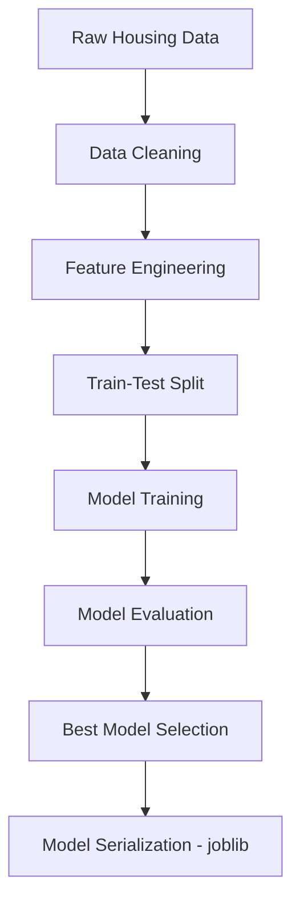

# 🏡 Real Estate Price Prediction using Machine Learning

<p align="center">
  
</p>

<p align="center">
  <a href="https://github.com/Abhishek-09-Tomar">
    
  </a>
  <a href="https://www.linkedin.com/in/abhishek-tomar-7aa29127b">
    
  </a>
</p>

---

## 📌 Project Overview

This project focuses on **predicting residential real estate prices** using classical **machine learning regression techniques**. The goal is to demonstrate a **clean, end-to-end ML workflow**—from data preprocessing and feature engineering to model training, evaluation, and deployment-readiness.

> ⚠️ **Note:** A full-fledged UI is **not currently included**. The project is structured to allow **easy UI integration in the future**.

---

## 🚀 Key Features

* End-to-end **ML regression pipeline**
* Multiple models trained and compared
* Clean feature engineering and preprocessing
* Model persistence using `joblib`
* Flask-ready backend for future UI deployment
* Reproducible and well-structured codebase

---

## 🧠 Machine Learning Workflow



---

## 📁 Project Structure

```
real-estate-price-prediction/
│
├── Evergreen_Estates/               # ML application layer
│   ├── app.py                       # Flask backend (UI-ready)
│   ├── Evergreen.joblib             # Serialized trained model
│   ├── templates/                   # HTML templates (future UI)
│   │   └── index.html
│   └── static/                      # Static assets (optional)
│
├── data.csv                         # Cleaned dataset
├── housing.data                     # Raw dataset
├── housing.names                    # Feature descriptions
├── Outputs_from_diff_model.txt      # Model comparison results
└── README.md
```

---

## 🛠️ Technology Stack

### 🔹 Programming Language

* **Python**

### 🔹 Machine Learning & Data

* pandas
* NumPy
* scikit-learn
* joblib

### 🔹 Backend (Optional / Future)

* Flask
* HTML / CSS

---

## 📊 Model Training & Evaluation

The following regression models were explored:

* Linear Regression
* Decision Tree Regressor
* Random Forest Regressor

**Evaluation Metrics:**

* Mean Squared Error (MSE)
* Root Mean Squared Error (RMSE)
* Cross-validation scores

All results are stored in:

```
Outputs_from_diff_model.txt
```

---

## ⚙️ Installation & Setup

```bash
# Clone the repository
git clone https://github.com/Abhishek-09-Tomar/real-estate-price-prediction.git

# Navigate to project directory
cd real-estate-price-prediction/Evergreen_Estates

# Install dependencies
pip install -r requirements.txt

# Run backend server (optional)
python app.py
```

Server runs at:

```
http://localhost:5000
```

---

## 📈 Example Usage

```python
# Load trained model
import joblib
model = joblib.load('Evergreen.joblib')

# Predict price
model.predict([[area, bedrooms, bathrooms, location]])
```

---

## 🎯 Use Cases

* Real estate price estimation
* ML regression practice project
* Academic learning and experimentation
* Backend for future full-stack ML apps

---

## 🔮 Future Enhancements

* Full web-based UI
* Interactive data visualizations
* Model explainability (SHAP / LIME)
* Location-aware pricing (maps)
* Cloud deployment (AWS / GCP / Azure)

---

## 🧪 Project Highlights

* Demonstrates **practical ML engineering skills**
* Clean separation of data, logic, and deployment
* Scalable architecture for UI integration
* Industry-relevant regression workflow

---

## 💼 Interview & Resume Talking Points

* Built an end-to-end ML regression pipeline
* Compared multiple models to optimize performance
* Applied feature engineering for price prediction
* Used joblib for production-ready model persistence
* Designed backend-ready ML service

---

## 📊 GitHub Statistics

<p align="center">
  
  
</p>

---

## 🤝 Connect With Me

* **GitHub:** [https://github.com/Abhishek-09-Tomar](https://github.com/Abhishek-09-Tomar)
* **LinkedIn:** [https://www.linkedin.com/in/abhishek-tomar-7aa29127b](https://www.linkedin.com/in/abhishek-tomar-7aa29127b)

---

## 📄 License

This project is licensed under the **MIT License**.

<p align="center">
  <i>Turning data into decisions through machine learning.</i>
</p>
